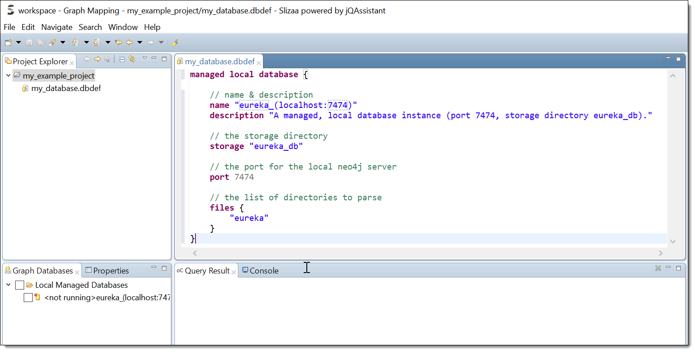

= Getting started
:page-layout: asciidoc
:header_footer: false

= Getting started

== Download and install

Download the latest slizaa distribution http://www.slizaa.org/download/[here]. The platform specific archive must be unpacked to an arbitrary folder on your local disc.
Start slizaa by double-clicking the slizaa executable that can be found in the installation directory.

== Creating software structure graphs with jQAssistant
If you start slizaa for the first time,
it opens the 'Graph Mapping' perspective as the default perspective (see figure 1).

image::images/getting_started/graph_mapping_perspective.png[caption="Figure 1. ", title="slizaa's initial perspective", width=1050]

The Graph Mapping perspective that is shown initially allows you to setup database connections,
to create and edit cypher queries and to execute them against a selected database, to map the flat Software Structure Graph stored in Neo4j
to an arbitrary hierarchical (in-memory) graph and more. The perspective mainly consists of the following viewers and areas:

. The *Project Explorer* provides a hierarchical view of the resources in your workspace.
. The *Editor area* is where you modify the contents of files in your workspace, e.g. cypher query files.
. The *Hierarchical Graphs Explorer* shows all mapped hierarchical (in-memory) graphs.
. The *Graph Databases Explorer* shows the graph database locations that you have added to slizaa.
. The *Query Result viewer* shows the result of a cypher query that you executed against a graph database instance.
. The *Uses/Used by viewers* show which nodes are referenced the selected nodes in the Hierarchical Graphs Explorer (Uses),
respectively which nodes are referencing the the selected nodes in the Hierarchical Graphs Explorer (Used by).

=== Install jQAssistant support
The jQAssistant distribution is not included in the slizaa distribution. In order to create your own local graph databases with slizaa, you have to install jQAssistant as a slizaa extension.
The easiest way to do so is to select `Help -> Install slizaa extension` in slizaa's main menu. This will open the Install Extensions dialog shown in figure 2.

image::images/getting_started/install_extensions.png[caption="Figure 2 ", title="Install jQAssistant as an extension", width=550]

Select 'jQAssistant distribution' and click through the wizard to finish the installation.

=== Create a new slizaa project
In order to work with slizaa, you have to create a slizaa project first. A slizaa project normally contains resources like graph database connection definitions, cypher queries, custom mappings and so on.
To create a new project, right click in the project explorer and select `New -> slizaa Project...`.

image::images/getting_started/create_new_slizaa_project.png[caption="Figure 3. ", title="Create a new slizaa project", width=700]

Specify the name of your project in the new project wizard (e.g. my_example_project) and click Finish.

=== Scan artifacts in a new jQAssistant database
With slizaa you have two different options for working with graph database instances:

. You can connect against a database instance that runs 'outside' from slizaa (that's what we call a _unmanaged remote database_), or
. you can create and start your own database instance from within slizaa (that's what we call a _managed local database_).

In both cases you have to define the database/database connection in a _database definition file_. To create a database definition file, right-click in the project explorer and select `New -> slizaa Database Definition File...`

...TO DO CONTINUED...

