= Getting started
:page-layout: asciidoc
:header_footer: false
:icons: font

= Getting started

== Download and install

NOTE: link:https://www.youtube.com/watch?v=i3QnYoP4NPQ[You can also watch this tutorial as a video on youtube!^]

Download the latest slizaa distribution http://www.slizaa.org/download/[here]. The platform specific archive must be unpacked to an arbitrary folder on your local disc.
Start slizaa by double-clicking the slizaa executable that can be found in the installation directory.

=== Install jQAssistant support
Out-of-the box you can connect against existing jQAssistant databases, e.g. a JQAssistant database that runs on your CI server.
But if you want to scan your own software and create your own databases from within slizaa, you have to install the jQAssistant extension.
Select `Help -> Install slizaa extensions...` to open the extensions dialog (see Figure 2).
The extensions dialog shows all available extensions for slizaa. Select the extension you want to install and follow the steps provided in the wizard.
Eclipse automatically restarts once the installation is complete.

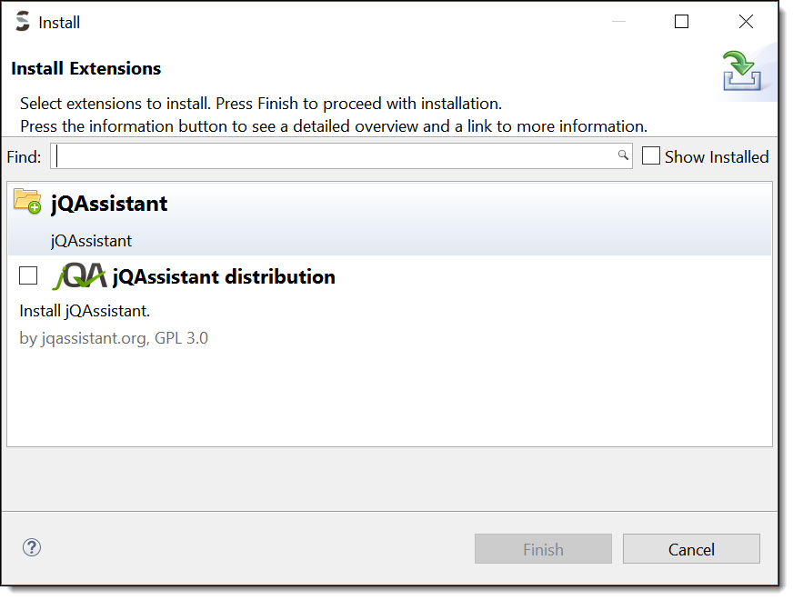

== Create software structure graphs with jQAssistant

NOTE: link:https://www.youtube.com/watch?v=likqJbBHdKI[You can also watch this tutorial as a video on youtube!^]

If you start slizaa for the first time,
it opens the 'Graph Mapping' perspective as the default perspective (see figure 1).

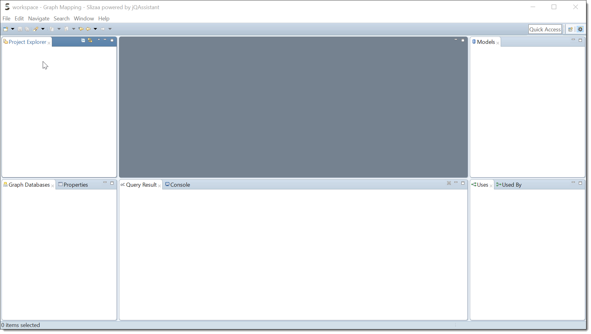

*Creating a new slizaa project.* In order to analyze software structure graphs with slizaa, you have to create a slizaa project first. A slizaa project normally contains resources like graph database connection definitions, cypher queries, custom mappings and so on.
To create a new project, right click in the project explorer and select `New -> slizaa Project...` (see Figure 3).

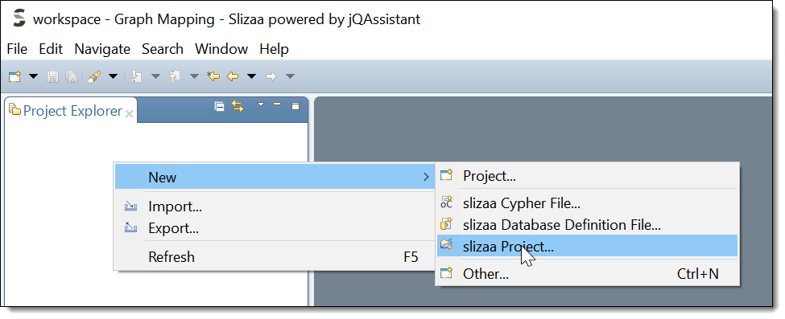

Specify the name of your project in the new project wizard (e.g. my_example_project) and click Finish.

=== Specify a local JQAssistant database
*Create a database definition file.* To set up a new jQAssistant database, you have to define the database (or the database connection) in a _database definition file_.
To create a database definition file, right-click in the project explorer and select `New -> slizaa Database Definition File...` (see Figure 4)

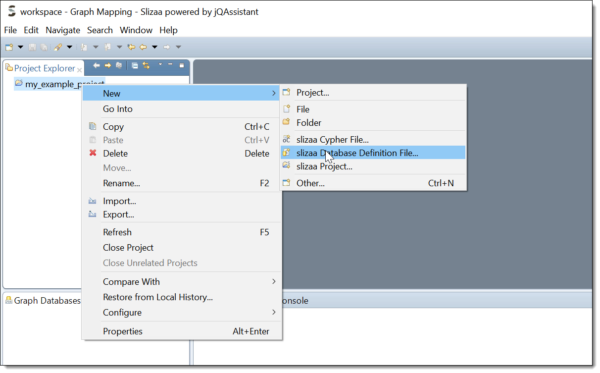

*Select a template.* Once the file is created, you can select a database definition template using the key shortcut `CTRL-SPACE` (see Figure 5). To create a new local database, choose
the _Managed Local Database_ template.

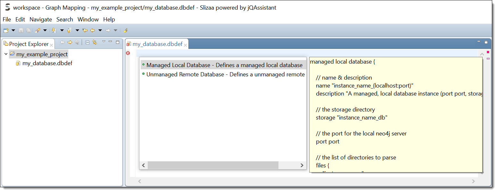

*Specify name and port.* In the template you have fill in the name of the software that you want to scan, as well as the port for the local jQAssistant server.
The storage directory for the local database and the directory that must contain the software to parse are automatically set with derived default values (see Figure 6).
In this tutorial we will analyze the Eureka web archive.
link:https://github.com/Netflix/eureka/[Eureka^] is a REST based service that is provided by Netflix and primarily used in the AWS cloud for locating services.

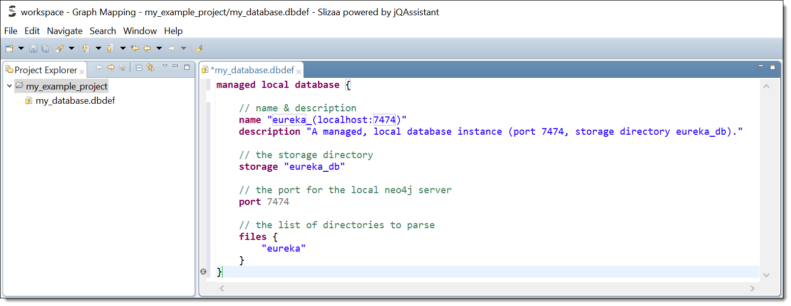

*Populate the scanning directory.* Finally you have to create the scanning directory that is specified in the database definition (the _files {...}_ section) and populate it with eureka web archive (see Figure 7).
You can download the eureka web archive link:https://search.maven.org/remotecontent?filepath=com/netflix/eureka/eureka-server/1.4.10/eureka-server-1.4.10.war[here^].

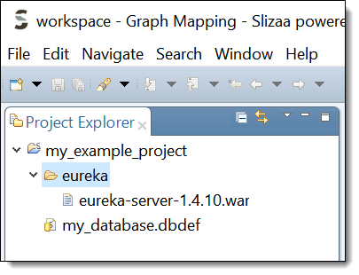

=== Create the software structure graph

*Scan the software.* Once you've created the database definition file, the database appears in the Graph Database view.
To create the database and populate it with the software structure graph, right-click on the database icon to open the pop-up menu.
Select `Scan` to scan the eureka web archive (see Figure 8).

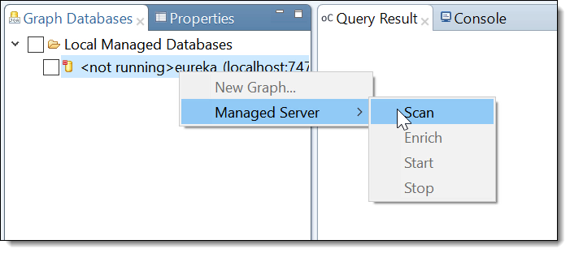

*Enrich the model.* The model created by the scanner represents the structure of a software project on a raw level.
jQAssistant uses so called concept rules to enrich the database with higher level information to ease the process of writing queries.
This typically means adding labels, properties or relations.
Select `Enrich` in the pop-up menu of the jQAssistant database to enrich the software structure graph (see Figure 9).

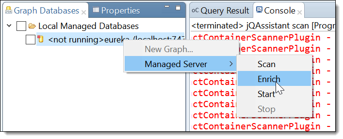

*Start the database server.* Finally you have launch the jQAssistent database server that hosts the structural information of the scanned application.
Select `Start` in the pop-up menu of the jQAssistant database to start the server (see Figure 10).

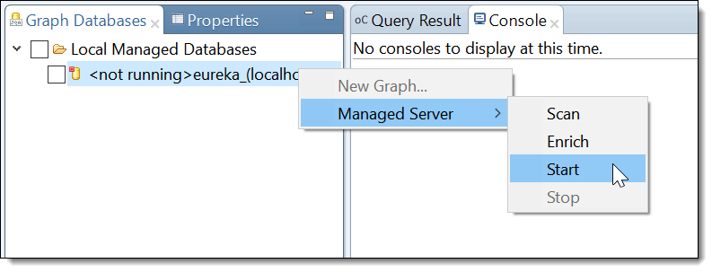

////
== Visualising software structure graphs

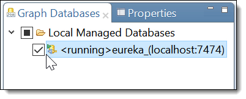

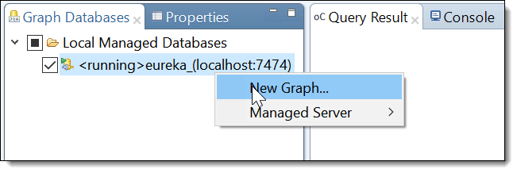

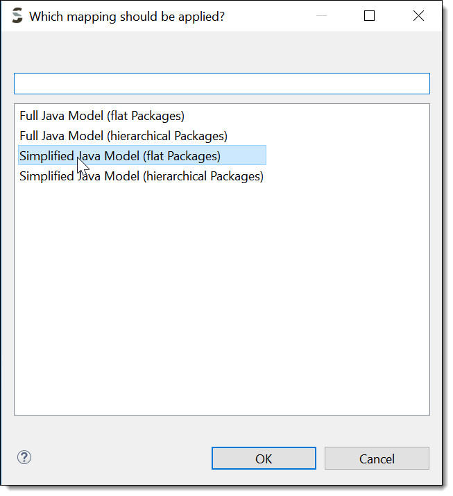

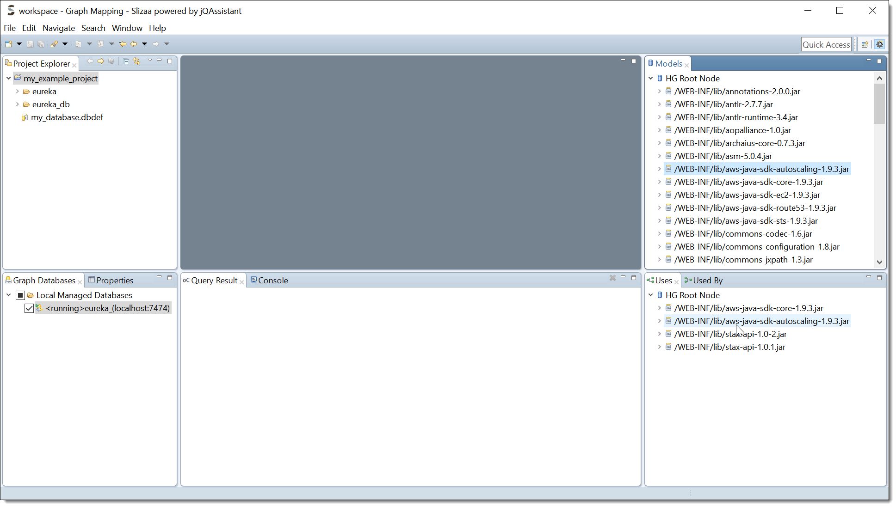
////
