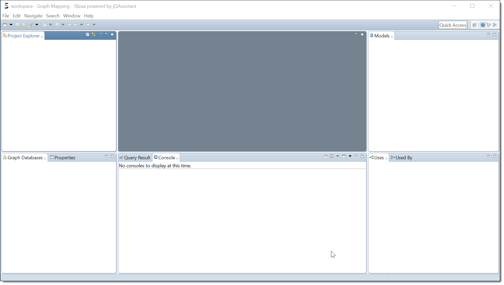

= Getting started
:page-layout: asciidoc
:header_footer: false

== Getting started

=== Download and install

Download the latest slizaa distribution http://www.slizaa.org/download/[here]. The platform specific archive must be unpacked to an arbitrary folder on your local disc.
Start slizaa by double-clicking the slizaa executable that can be found in the installation directory. If you start slizaa for the first time,
it should look similar figure 1.

