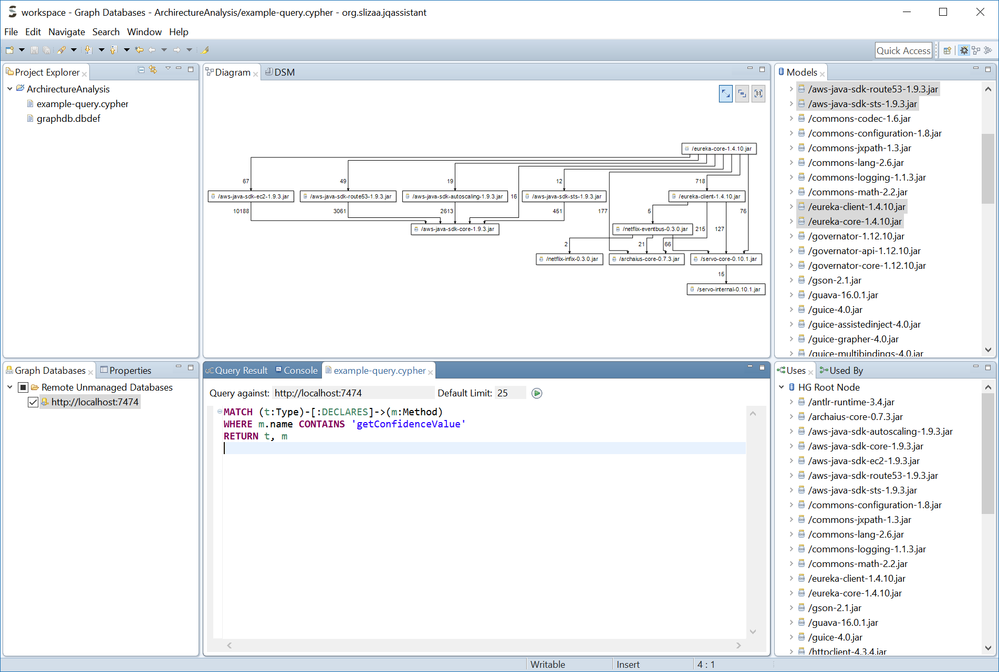
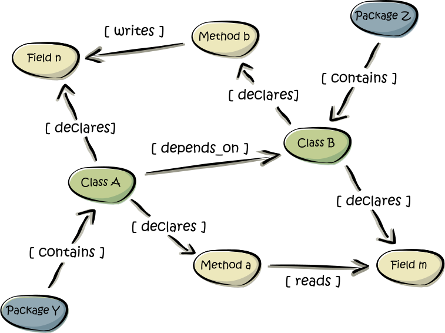
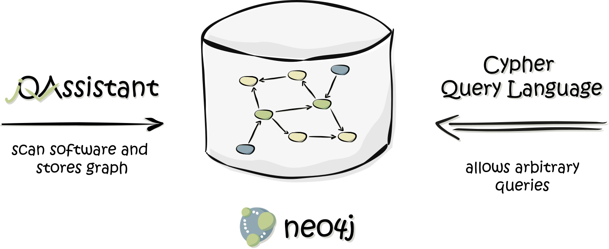
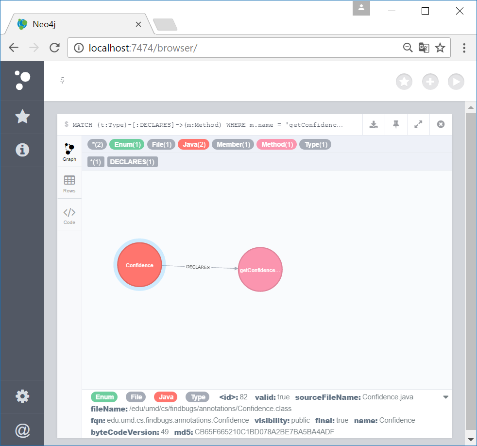
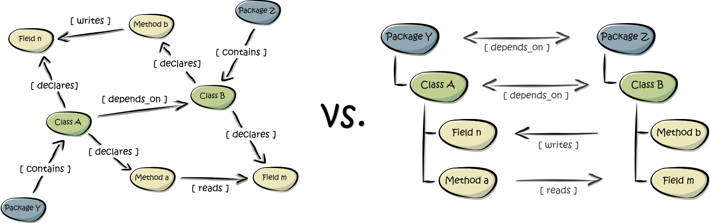

= Basic concepts
:page-layout: asciidoc
:header_footer: false

== What is slizaa?

slizaa is an interactive workbench for graph-based analysis of software structures.

slizaa is centered around the concept of <<What is a Software Structure Graph?,Software Structure Graphs>>
and is based on <<What is Neo4j?, Neo4j>>. slizaa allows you to map flat Software Structures Graphs stored in Neo4j to arbitrary <<Flat graphs vs. hierarchical graphs, hierarchical graphs>> that can be
interactively inspected, analyzed and visualized using specialized, 'hierarchical-graph-aware' tools. Using the <<What is the Cypher Query Language?, Cypher Query Language>> you can defined
your own custom queries and project the result to slizza's mapped graph.

slizaa provides out-of-the-box-support for <<What is jQAssistant?, jQAssistant>>, an outstanding QA tool which allows the creation of Software Structure Graphs for java based system.

== What is a Software Structure Graph?

Software systems consist of multiple _elements_, e.g. class files, types, packages or configuration files. Usually all of these elements are related somehow to each other.
For example, in java based systems _class files_ define _types_ that contain one ore more _methods_ or _fields_. Types again can extend or implement other types.

All those elements and relationships can be represented as a _directed graph_ (see Figure 1), the Software Structure Graph (SSG). The nodes of the SSG are the elements of the considered software system:
archives, files, types, methods, fields and so on. The egdes represent the relationships between the elements (e.g. 'contains', 'declares', 'implements', 'extends', 'reads').
In addition, elements and relationship can have arbitrary properties that describe attributes of the corresponding elements (e.g. the method name or visibility).

== SSGs with jQAssistant and Neo4j
An outstanding tool for creating Software Structure Graphs is jQAssistant, which in turn relies on Neo4j (see Figure 2). Both tools are open source and licensed under GPL 3.
slizaa relies on Neo4j and provides out-of-the-box-support for jQAssistant.

=== What is Neo4j?
link:https://neo4j.com/developer/get-started/[Neo4j^] is a popular open source graph database implementation by Neo Technology.
A graph database is a database that uses graph structures for semantic queries with nodes, edges and properties to represent and store data.
Neo4j is implemented in Java and accessible from software written in other languages using the Cypher Query Language through a transactional HTTP endpoint.
If you are new to graph database or Neo4j in particular, we highly recommend link:https://neo4j.com/developer/graph-database/[this article^].

=== What is jQAssistant?
link:http://jqassistant.org/[jQAssistant^] is is a QA tool which allows the definition and validation of project specific rules on a structural level.
It is built upon Neo4j and can easily be plugged into the build process to automate detection of constraint violations and generate reports about user defined concepts and metrics.

What jQAssistant basically does is to parse a given software system and to store the structural information as a Software Structure Graphs in a Neo4j instance.
The user can define his own custom rules using the Cypher Query Language to detect structural defects or anomalies.
These rules are executed automatically against the stored Software Structure Graph during the project build.
Beneath the execution of jQAssistant during a automated project build, jQAssistant can also be used as commandline-tool. Doing so, you can start the embedded Neo4j server from the shell
and execute Cypher Queries using the build-in Neo4j web console (see Figure 4).

=== What is the Cypher Query Language?
The Cypher Query Language (or in short Cypher) is a declarative, SQL-inspired language for describing patterns in graphs.
If you are new to the Cypher Query Language, we highly recommend link:https://neo4j.com/developer/cypher-query-language/[this article^].
Using cypher, you can search for arbitrary pattern in your Software Structure Graph.

==== Examples:

* Which types declare a method with the name 'getConfidenceValue'?
+
[source,cypher]
----
MATCH (t:Type)-[:DECLARES]->(m:Method)
WHERE m.name = 'getConfidenceValue'
RETURN t
----

* Which classes contain the highest number of methods?
+
[source,cypher]
----
MATCH
  (class:Class)-[:DECLARES]->(method:Method)
RETURN
  class.fqn, count(method) as Methods
ORDER BY
  Methods DESC
LIMIT 20
----

== Flat graphs vs. hierarchical graphs

The Software Structure Graph provided by jQAssistant is a so-called _flat graph_. A flat graph has exactly one layer that contains all nodes and relationships.
As a result all nodes and relationships of the Software Structure Graph a placed in one layer as well, regardless if two nodes have a USAGE-Relationship (e.g. 'extends' or 'calls') or
a CONTAINMENT-Relationship (e.g. 'contains' or 'declares'). As this is perfectly fine as long as we query specific patterns using Cypher,
it fails nearly immediately for interactively browsing through the code: The flat simply provides to much information at once.

For this reason the building blocks of software software systems are usually organized in hierarchies (e.g. archives contain packages, packages contain packages and/or types,
types declare methods and fields and so on). Instead of placing all elements in one single layer, hierarchical graphs provide multiple layers that
have well-defined parent-child-relationships (see Figure 5).

Organizing graph elements hierarchically has two consequences for the resulting graph:

- *Containment- and Usage-Relationships are strictly distinguished.* Containment-Relationships form the parent-child-relationship of the hierarchy,
whereas Usage-Relationships define which other nodes are actually _used_ by given node.
- *Parent nodes aggregate relationships of child nodes.* If a node (e.g. 'Method a') has a relationships to another node (e.g. 'Field m'),
then the ancestors of this node a (e.g. 'Class A' or 'Package Y') have (aggregated) relationships to the referenced node and it's ancestors (e.g. 'Class B' or 'Package Z')
