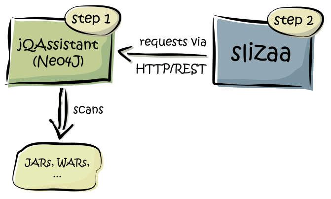

= Get started
:page-layout: asciidoc
:header_footer: false

== Get started

Slizaa allows you to inspect and visualize the structure of an application, but it does neither scan nor store the structural information by itself. Instead, it uses jQAssistant (which in turn uses Neo4J)
as it's backend. In order to setup slizaa, you have to install and run jQAssistant first (that is part 1 of this guide). Once jQAssistant is up and
running, you can start slizaa and connect against the running jQAssistant server (that's part 2 of this guide).

== Step 1: Install and run jQAssistant

=== Install jQAssistant

Download the latest jQAssistant distribution http://jqassistant.org/wp-content/uploads/2016/04/jqassistant.distribution-1.1.3-bin.zip[here]. The archive contains a directory 'jqassistant.distribution-1.1.3' that must be unpacked in an arbitrary folder on your local disc.

=== Scan you application
Put all the JAR files (or WAR files) that belong to your application in the '<jQAssistant_install_dir>/lib' folder. The JAR files will be scanned during the scanning process using the following command.
The structural information will be stored in a Neo4J graph database that is located in the specified directory (e.g. 'jqassistant/myExampleDB').

[square]
* _Windows_
[source,shell]
 .\bin\jqassistant.cmd scan -f lib -s .\jqassistant\myExampleDB

 * _Linux_
[source,shell]
 ./bin/jqassistant.sh scan -f lib -s jqassistant/myExampleDB

=== Enrich your application model
[square]
 * _Windows_
[source,shell]
.\bin\jqassistant.cmd analyze -concepts classpath:Resolve -s jqassistant/myExampleDB

 * _Linux_
[source,shell]
./bin/jqassistant.sh analyze -concepts classpath:Resolve -s jqassistant/myExampleDB

=== Start the jQAssistant server
Now you are ready to launch the jQAssistent server that hosts the structural information of the scanned application.

[square]
 * _Windows_
[source,shell]
.\bin\jqassistant.cmd server

 * _Linux_
[source,shell]
./bin/jqassistant.sh server

Open a browser and navigate to http://localhost:7474.

